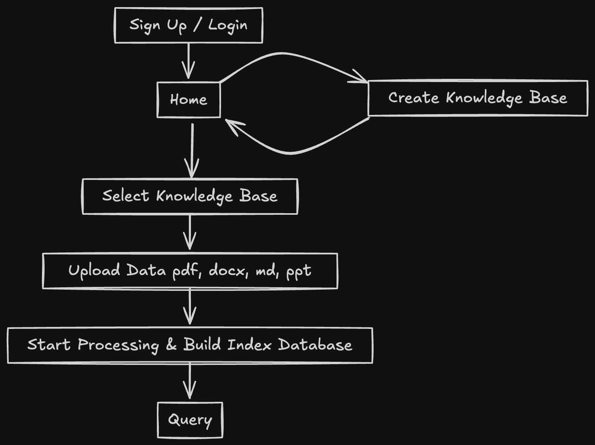

<!-- _class: lead -->

# Data Engine
#### 開發進度報告

 

**Syuan-Hao Li**
DDT, Cathay Holding

---

<!-- _header: Table of Contents -->
<!-- _class: lead -->

1. Tech stack
1. Workflow
1. Feature
1. Future plan

---

<!-- _header: Tech stack -->
<!-- _class: lead -->

- **Web**: Streamlit
- **Backend**: FastAPI
- **Database**: SQLite, MongoDB, InfinityDB
- **File Storage**: MinIO
- **LLM Inference**: OpenRouter
- **LLM Embedding**: Fastembed

---

<!-- _header: Workflow -->

## User Workflow

---

<!-- _header: Workflow -->

## Server Workflow

---

<!-- _header: Workflow -->

## Data Pipeline

---

<!-- _header: Feature -->

- Traceability
- Multi-language support
- Support multiple data formats:
    - PDF
    - DOCX
    - PPTX
    - Markdown
- One-click deployment
- Complete API

---

<!-- _header: Future Plan -->
<!-- _class: lead -->

- Develop corresponding MCPs
- Performance optimization

---

<!-- _class: lead -->

# Thank you!