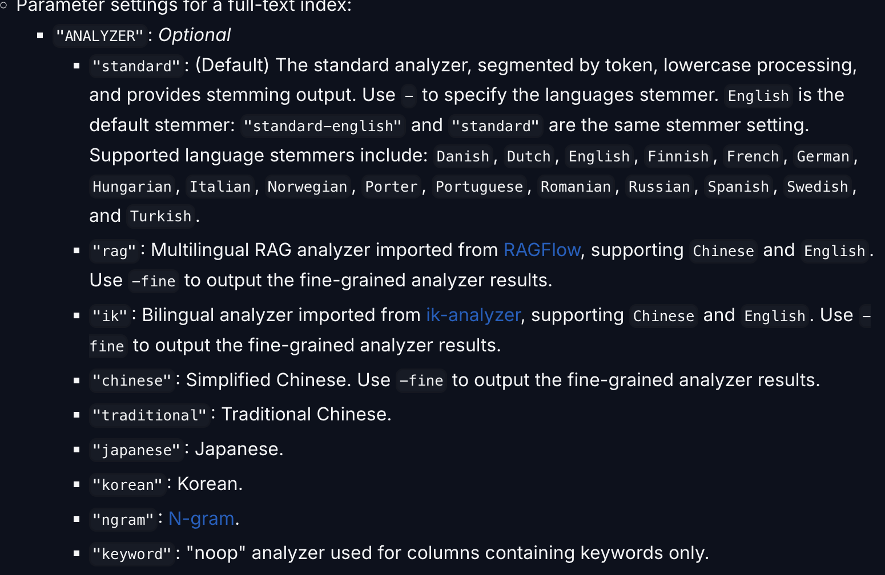
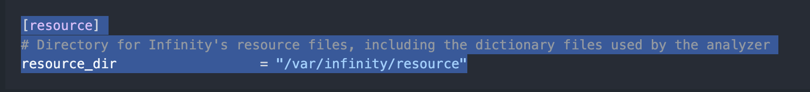
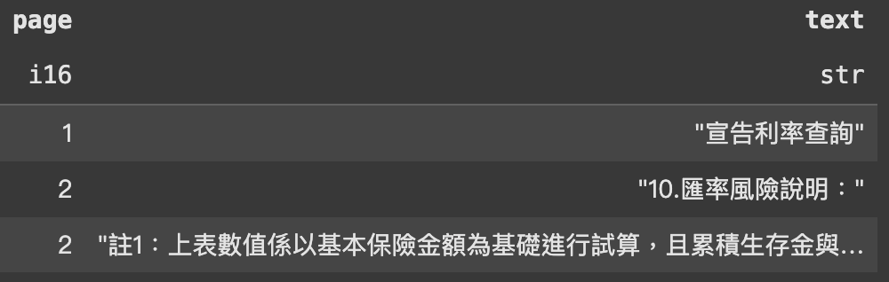
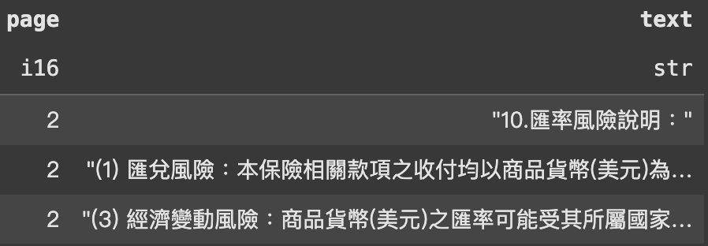
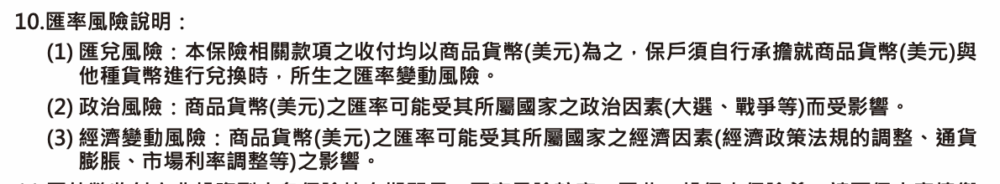
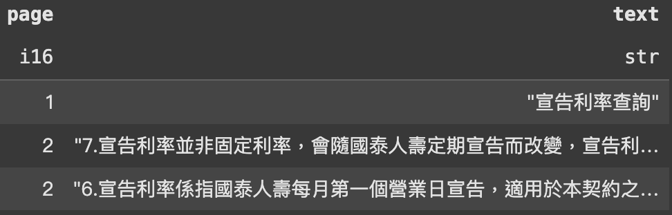
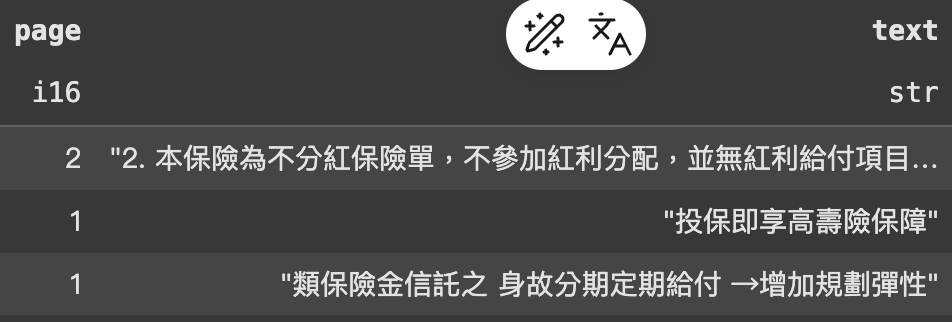

<!-- _class: lead -->

# Weekly Report

## 03/10 - 03/14

---

<!-- _header: 大綱 -->

- 前端跟後端的部分功能串接
- text 表格新增 embedding
- Hybrid search 測試
- infinity analyser 的設定

---

<!-- _header: 遇到的問題 -->

### infinity analyser 無法使用



---

<!-- _header: 遇到的問題 -->

### infinity analyser 無法使用



```bash
git clone https://github.com/infiniflow/resource.git
mv resource /var/infinity
```

```py
idx_name = "test_text_index1"
res_index = texts_table.create_index(
        idx_name,
        infinity_embedded.index.IndexInfo("text", infinity_embedded.index.IndexType.FullText,{"analyzer": "rag"}),
        infinity_embedded.common.ConflictType.Error,
    )
```

---

<!-- _header: Demo -->

### Hybrid Search

#### 利率是多少



---

<!-- _header: Demo -->

#### 匯率風險說明




---
<!-- _header: Demo -->

#### 宣告利率是固定利率嗎？




---

<!-- _header: Demo -->

#### 這個保險有參加紅利分配嗎？




---

<!-- _header: Demo -->